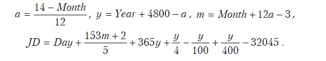
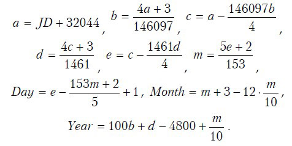
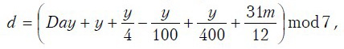
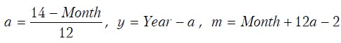

# День недели

Напишите программу, которая по дате определяет день недели, на который эта дата приходится, и очередной год, в который заданное число будет приходиться на пятницу. 

В помощь: [Юлианская дата](https://ru.wikipedia.org/wiki/Юлианская_дата)

## Вход
Аргумент командной строки содержит строку содержащую дату в формате `dd.mm.yyyy`

## Выход
Если в командной строке были переданы неверные данные (ошибочный формат или недопустимая дата), то вывести сообщение об ошибке: `Unknown`. 

Если строка в заданном формате, в первой строке вывести название дня недели: `Monday`, `Tuesday`, `Wednesday`, `Thursday`, `Friday`, `Saturday`, `Sunday`. 
Во второй строке вывести очередной год, в который заданное число будет приходиться на пятницу.

## Требования
Программа не должна использовать контейнеры STL (std::vector, std::string и т. д.). 

## Пример 
Командная строка:
```
   ./dayofweek 31.10.2022
```
Вывод на экран: 
```
Monday
2025
```

## Приложение: Перевод даты григорианского календаря в юлианскую дату



Здесь *Year* – номер года, *Month* – месяца, *Day* – дня в григорианском календаре, *JD* – номер юлианского дня, который начинается в полдень числа, для которого производятся вычисления.
Все деления целочисленные.

Для обратного перевода (т.е. чтобы перевести юлианскую дату в день, месяц и год) можно использовать эти формулы:


## Приложение: Вычисление дня недели для григорианского календаря


 

где *Year* – номер года, *Month* – месяца, *Day* – дня. 

Все деления целочисленные. Вычисленное по формуле значение определяет день недели: 0 – воскресение, 1 – понедельник, ..., 6 – суббота.

